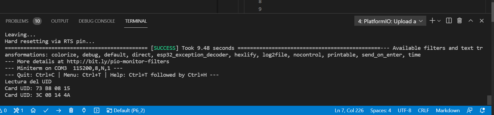

# PRACTICA 6 
### PARTE 2:
Siguiendo la programacion que se nos proporciona para realizar la practica podemos ver que la primera parte hacemos la declaracion de varios pines(SS_PIN, RST_PIN) y la cracion del objeto del componente RC522 a taves del comando MFRC522 mfrc522(SS_PIN, RST_PIN); 
Seguidamente encontramos el  bloque del setup en el cual hay un cojunto de comandos, para empezar nos encontramos con el serial.begin a la misma velocidad que la del monitor_speed que se encuentra en el .ini segido del comando SPI.begin(14,12,13,15) el cual nos indicia el bus SPI en los pines segun el modo HSPI posteriormente esta el comando mfrc522.PCD_Init(); el cual nos inicia el componente MFRC522 y por ultimo un print que nos informa que empieza la lectura del UID que estara programa en el siguiente bloque que es el loop.
Dento del loop nos encontramos dos if uno dentro de otro, el primero de ellos revisa si detecta nuevas tarjetas a traves del comando mfrc522.PICC_IsNewCardPresent() si esto se cumple pasara a comprobar el siguiente if que nos revisa que tipo de tarjeta nos detecta, es decir si la tarjeta que detecta es una de las validas que detecta este componente, para asi posteriormente si estas dos condiciones se cumplen mostrarnos un print de card UID: seguido de la lectura y muestra del vector que contiene el nombre de la tarjeta detectada a traves del bucle y los comandos for (byte i = 0; i < mfrc522.uid.size; i++) { Serial.print(mfrc522.uid.uidByte[i] < 0x10 ? " 0" : " "); Serial.print(mfrc522.uid.uidByte[i], HEX);} que hacen que aparezca el nombre por pantalla correctamente. por ultimo nos encontramos con el comando mfrc522.PICC_HaltA(); que es utilizado para indicar que la lectura de la tarjeta detectada a finalizado y que se deje de cumplir la condicion del primer if, como todo esto en el loop sera repetido infinitamente hasta que paremos el programa.
Por tanto como conlusion podemos decir que lo que podemos observar en la terminal/monitor seria el conjunto de nombres (UID) de las tarjetas validas detectadas por el RC522 de forma infinita y separadas por el orden de su detetecion. A continuacion hay una captura de la terminal donde se ven dos distitas tarjetas que detecta este componente.
Captura de lo observable a traves de la terminal/monitor detectando los dos distitos tipos de tarjeta validas:

